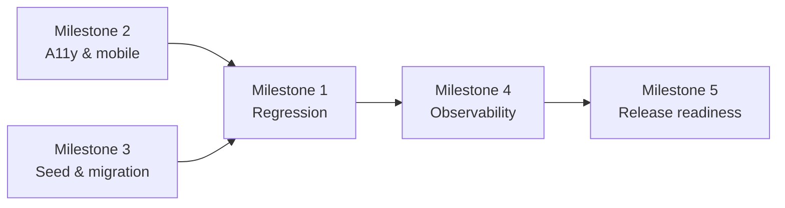

# Sprint 10 Plan: Release Readiness & Platform Stabilization

## Goal

Stabilize the task/KPI platform, close regression gaps, and prepare the system for release with the performance, accessibility, and operational checks needed for a safe handoff.

## Scope

This sprint is the final hardening buffer for F4 after the feature sprints are complete.

In scope:
- End-to-end regression coverage
- Accessibility and mobile polish
- Seed/demo data and migration cleanup
- Observability, audit verification, and alert readiness
- Final release checklist and rollback preparation

Out of scope for this sprint:
- New user-facing task features
- New KPI formulas or dashboards
- Structural changes to the task model

## Milestone Breakdown

### Milestone 1: End-to-end regression suite

Coverage items:
- Verify that all task creation, execution, view, automation, and KPI flows still work together.

Implementation surfaces:
- `tests/e2e/tasks/*.spec.ts`
- `tests/e2e/kpi/*.spec.ts`
- `tests/integration/task-flows.spec.ts`

Dependencies:
- Depends on all task/KPI implementation work from Sprints 4-9.

Test cases:
- Create task -> assign -> progress -> review -> KPI flow passes end to end.
- Reassign, reject, and approve paths still function after regression changes.
- Board, timeline, and dashboard views reflect the same task state.

Effort: 10 hours/person

### Milestone 2: Accessibility and mobile polish

Coverage items:
- Ensure the task platform is usable on mobile and with keyboard/screen-reader interaction.

Implementation surfaces:
- `app/tasks/*.tsx`
- `components/tasks/*.tsx`
- `components/dashboard/*.tsx`

Dependencies:
- Depends on the existing responsive patterns from Sprint 3 and the task UI components from Sprints 4-6.

Test cases:
- Core task views remain readable at mobile widths.
- Board and table controls are keyboard reachable.
- Focus states and labels are present on interactive controls.

Effort: 10 hours/person

### Milestone 3: Seed data and migration cleanup

Coverage items:
- Stabilize sample data and ensure migrations can backfill task/KPI history safely.

Implementation surfaces:
- `prisma/migrations/*`
- `prisma/seed.ts`
- `lib/db/backfill.ts`

Dependencies:
- Depends on the final schema shape after task, KPI, and audit work is complete.

Test cases:
- Seed data creates a realistic department/task hierarchy.
- Backfill scripts can run idempotently.
- Migrations do not break existing task references.

Effort: 10 hours/person

### Milestone 4: Observability, logs, and admin alerts

Coverage items:
- Confirm that task mutations, KPI jobs, and critical failures are visible in logs and alerts.

Implementation surfaces:
- `lib/observability/*.ts`
- `lib/audit-logger.ts`
- `lib/notifications/*.ts`

Dependencies:
- Depends on the audit log and notification pipelines from prior sprints.

Test cases:
- Critical task mutations emit traceable logs.
- Audit log entries can be queried for a recent change.
- Notification failures surface a visible retry/fallback path.

Effort: 8 hours/person

### Milestone 5: Release checklist and rollback readiness

Coverage items:
- Final approval criteria, rollback plan, and handoff notes for the task/KPI release.

Implementation surfaces:
- `docs/release-checklist.md`
- `docs/runbooks/task-kpi-release.md`
- `docs/testing.md`

Dependencies:
- Depends on stable feature work and passing regression coverage.

Test cases:
- Release checklist has a clear pass/fail gate.
- Rollback steps exist for schema and app-layer changes.
- Handoff notes identify any known residual risk.

Effort: 8 hours/person

## Dependency Map

Key coverage dependencies:
- Regression coverage should be the last gate before release signoff.
- Seed and migration work must be validated against the final task and KPI schema.
- Release readiness should only happen once logs, alerts, and audit entries are verifiable.

## Implementation Order

1. Milestone 1
2. Milestone 2
3. Milestone 3
4. Milestone 4
5. Milestone 5

## Effort Summary

- Milestone 1: 10 hours/person
- Milestone 2: 10 hours/person
- Milestone 3: 10 hours/person
- Milestone 4: 8 hours/person
- Milestone 5: 8 hours/person
- Total: 46 hours/person

## Repository Links

- [PRD](../PRD.md)
- [Architecture](../ARCHITECTURE.md)
- [Decision Log](../decision-log.md)
- [Testing Guide](../testing.md)

## Maintenance Note

Update this file when release criteria, regression scope, migration behavior, or observability expectations change.