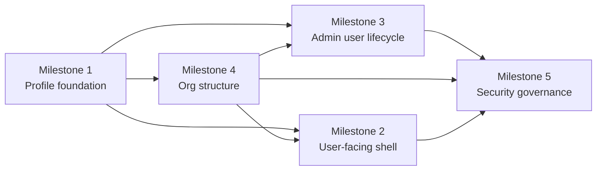

# Sprint 3 Plan: User Experience, Admin Operations & Governance

## Goal

Build the user/profile and admin-management foundation that sits on top of the auth and session baseline from Sprints 1 and 2. This sprint makes the platform usable for everyday employees and actionable for admins before task/KPI work starts.

## Scope

This sprint covers the F2, F3, and F5 slices that are needed to make user, organization, and governance flows operational.

In scope:
- Profile read/update flows
- Avatar and preference management
- User-facing discovery surfaces such as onboarding, employee directory, and org chart
- Admin user lifecycle, import/export, search, and audit trail
- Department and team management
- Security policy, access control, and compliance surfaces

Out of scope for this sprint:
- Task/KPI execution features from F4
- Task boards, task comments, progress updates, and KPI calculation workflows
- Any new session/auth primitives already covered in Sprints 1 and 2

## Milestone Breakdown

### Milestone 1: Profile foundation and personal settings

User stories:
- US-111
- US-112
- US-113
- US-114
- US-115
- US-116
- US-117
- US-129
- US-139
- US-140

What it delivers:
- A complete self-service profile area with editable identity, contact, avatar, language, timezone, theme, and password guidance.

Dependencies:
- Depends on authenticated user identity and the `profiles` table from the auth foundation.
- Avatar handling depends on the storage flow and a shared profile image fallback.
- US-117 depends on a metrics read model; if the KPI snapshot source is not ready yet, expose the widget contract first and bind the data source later.

Test cases:
- Profile page loads only the signed-in user’s record.
- Immutable fields stay read-only and cannot be saved from the client.
- Display name and phone number validate before update.
- Avatar upload rejects unsupported file types and oversized files.
- Avatar removal falls back to the default generated avatar.
- Password change requires current password, new password strength, and confirmation match.
- Language and timezone persist and rehydrate correctly.
- Dark/light mode preference applies immediately and persists across refresh.
- KPI badge widgets render empty, loading, and populated states safely.

Effort: 38 hours/person

### Milestone 2: User-facing shell, onboarding, and discovery

User stories:
- US-121
- US-124
- US-131
- US-132
- US-134
- US-135
- US-137

What it delivers:
- A cleaner first-run and navigation experience: onboarding tour, employee directory, org chart, system maintenance surfaces, mobile-friendly presentation, and keyboard shortcut guidance.

Dependencies:
- Depends on the profile and department model introduced in Milestones 1 and 4.
- Directory and org chart views consume the same profile/department records used by admin screens.
- Maintenance/offline screens share the same app shell and route-level layout conventions.

Test cases:
- First-login onboarding appears once and can be skipped.
- Onboarding state persists after completion.
- Employee directory supports name and department search.
- Org chart renders a correct tree with department hierarchy.
- Maintenance banner appears with countdown when a maintenance window is active.
- Offline page renders cleanly when the app is unavailable.
- Responsive layout works on mobile widths without breaking primary auth/profile flows.
- Keyboard shortcut help lists the documented shortcuts and is accessible from the UI.

Effort: 30 hours/person

### Milestone 3: Admin user lifecycle and import/export

User stories:
- US-133
- US-201
- US-202
- US-203
- US-204
- US-205
- US-206
- US-207
- US-208
- US-209
- US-221
- US-222
- US-223
- US-224
- US-225

What it delivers:
- Full admin control over user creation, updates, activation state, bulk import/export, search, dashboard visibility, contract lifecycle, and account-approval flows.

Dependencies:
- Depends on the profile and department records from Milestones 1 and 4.
- Audit logging requires the shared audit trail infrastructure and action model.
- Invite/reset email flows depend on the mailer abstraction and stable user lifecycle events.

Test cases:
- Create-user validation blocks duplicate email and missing required fields.
- Update-user flow prevents edits to locked fields such as email.
- Deactivate-user flow marks the account inactive and invalidates access immediately.
- Reactivate-user flow restores access without losing profile history.
- Search, filter, sort, and pagination behave consistently on the user table.
- Password reset supports both emailed and manual reset paths.
- Excel import validates rows before commit and reports row-level failures.
- Excel export respects the active filter set and generated file format.
- Audit log shows who changed what, when, and the before/after values.
- Employee transfer between departments updates membership and emits notifications.
- Admin dashboard widgets load from the same user-state source as the table view.

Effort: 54 hours/person

### Milestone 4: Organization structure and team management

User stories:
- US-211
- US-212
- US-213
- US-214
- US-215
- US-216
- US-217
- US-218
- US-219
- US-220
- US-226
- US-227
- US-228

What it delivers:
- Department CRUD, organization reshaping, team ownership, membership management, and capacity rules that make the company structure editable without breaking downstream user/admin flows.

Dependencies:
- Depends on the department and profile models established earlier in the sprint.
- Merge/split flows depend on the admin user transfer rules from Milestone 3.
- Team membership rules depend on department membership and role assignment constraints.

Test cases:
- Department names remain unique and cannot be created blank.
- Department deletion is blocked when dependencies still exist.
- Department detail screens show the correct employee and team counts.
- Team creation enforces leader membership and team membership rules.
- Adding/removing team members respects same-department constraints.
- Leader changes preserve team integrity and emit audit entries.
- Merge and split workflows preview affected users before commit.
- Capacity warnings appear when department limits approach the configured threshold.
- Self-join requests for open teams follow the approve/reject flow.

Effort: 58 hours/person

### Milestone 5: Security governance and access policy

User stories:
- US-118
- US-119
- US-120
- US-125
- US-127
- US-130
- US-138
- US-210
- US-229
- US-230

What it delivers:
- Admin-facing policy controls for sessions, passwords, IP filtering, inactivity handling, SSO, role composition, and custom permission groups.

Dependencies:
- Depends on user lifecycle data, department scoping, login/session metadata, and audit logging from earlier milestones.
- Policy values should be persisted in the shared security-policy model so changes apply immediately.
- Permission matrix and custom permission groups depend on the role graph already present in the user/admin model.

Test cases:
- Admin session views filter and summarize active sessions correctly.
- Password policy changes take effect immediately for new validations.
- Account-expiration alerts trigger at the configured lead times.
- Weekly security reporting aggregates login success/failure and lockout data accurately.
- IP whitelist blocks non-approved addresses and logs the rejection.
- Inactive-account automation warns before deactivation and deactivates on schedule.
- Google Workspace SSO can be toggled on and off safely.
- Users with multiple roles receive the combined effective permissions.
- Custom permission groups can be assigned and inspected correctly.
- Permission matrix renders the correct read/write/delete combinations per role.

Effort: 48 hours/person

## Dependency Map

Key story-level dependencies:
- US-112, US-113, US-114, US-115, US-116, US-129, and US-140 all build on the profile record created by US-111.
- US-131 and US-132 need department/profile data from the org model before they can render meaningful hierarchy.
- US-202, US-203, US-204, US-206, US-221, US-224, and US-225 rely on department and audit data already being in place.
- US-219 and US-220 depend on the base department CRUD and transfer rules before merge/split can be safe.
- US-229 and US-230 depend on the role graph and permission model introduced in the admin/governance layer.

## Implementation Order

1. Milestone 1
2. Milestone 4
3. Milestone 3
4. Milestone 2
5. Milestone 5

## Effort Summary

- Milestone 1: 38 hours/person
- Milestone 2: 30 hours/person
- Milestone 3: 54 hours/person
- Milestone 4: 58 hours/person
- Milestone 5: 48 hours/person
- Total: 228 hours/person

## Repository Links

- [PRD](../PRD.md)
- [Architecture](../architecture.md)
- [Decision Log](../decision-log.md)
- [Testing Guide](../testing.md)

## Maintenance Note

Update this file when a profile field, admin workflow, department rule, or security policy changes, or when a new dependency is introduced between user/admin/governance surfaces.