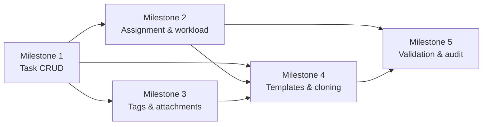

# Sprint 4 Plan: Task Foundation & Authoring

## Goal

Build the core task authoring layer so managers can create, edit, assign, tag, attach files, and clone tasks safely before any execution or reporting workflow begins.

## Scope

This sprint covers the first slice of F4: task data entry, assignment, metadata, workload safety, and reusable task templates.

In scope:
- Task create/edit/delete foundation
- Priority and weight configuration
- Assignee selection and workload checks
- Multi-assignee support and reassignment guardrails
- Tags, attachments, cloning, and templates
- Emergency task handling when weight rules are exceeded

Out of scope for this sprint:
- Task execution status changes
- Comments and threaded collaboration
- Kanban/Gantt/Calendar views
- KPI scoring and reporting
- Sub-task and approval workflows

## Milestone Breakdown

### Milestone 1: Task data model and CRUD core

User stories:
- US-301
- US-304

What it delivers:
- The first usable task form and persistence path with title, description, deadline, priority, and manager ownership.

Implementation surfaces:
- `prisma/schema.prisma`
- `app/api/tasks/route.ts`
- `app/api/tasks/[id]/route.ts`
- `components/tasks/task-form.tsx`
- `lib/tasks/validation.ts`

Dependencies:
- Depends on the department, profile, and role model from Sprint 3.
- Depends on the task schema and `task_status` enum in the shared architecture.

Test cases:
- Create task rejects blank title and invalid due date.
- Priority is required and stored consistently.
- Manager can create and edit a task they own.
- Delete removes the task from list and detail views.
- Validation returns the documented JSON error envelope.

Effort: 18 hours/person

### Milestone 2: Assignment, workload, and capacity guardrails

User stories:
- US-305
- US-308
- US-310
- US-324
- US-325

What it delivers:
- Assignee selection, multi-assignee distribution, reassignment, workload preview, and emergency task override with explicit reason capture.

Implementation surfaces:
- `app/api/tasks/[id]/assignees/route.ts`
- `app/api/tasks/[id]/reassign/route.ts`
- `components/tasks/assignee-picker.tsx`
- `components/tasks/workload-modal.tsx`
- `lib/tasks/workload.ts`

Dependencies:
- Depends on `task_assignees`, profile status, and department membership checks.
- Depends on the user status rules so disabled users cannot receive new assignments.

Test cases:
- Workload modal shows current tasks and weight used for the assignee.
- Multi-assignee task keeps the per-assignee weight consistent.
- Reassign recalculates the old and new assignee workload.
- Emergency task requires a reason when crossing the normal weight limit.
- Disabled assignee cannot be selected for a new assignment.

Effort: 28 hours/person

### Milestone 3: Tags and attachments

User stories:
- US-302
- US-303

What it delivers:
- Task classification with tags and file attachments so managers can organize work and share context before execution starts.

Implementation surfaces:
- `components/tasks/task-tags.tsx`
- `components/tasks/task-attachments.tsx`
- `app/api/tasks/[id]/attachments/route.ts`
- `app/api/tasks/[id]/tags/route.ts`
- `lib/storage/task-files.ts`

Dependencies:
- Depends on the task record and upload/storage integration.
- Depends on the shared validation rules for file size and file type.

Test cases:
- Max 5 tags per task is enforced.
- Duplicate tags are rejected or de-duplicated consistently.
- Attachment upload rejects unsupported file types.
- Attachment upload rejects files above the size limit.
- Download is protected by task authorization.

Effort: 16 hours/person

### Milestone 4: Templates and cloning

User stories:
- US-306
- US-311

What it delivers:
- Task templates for repeated work and a safe clone flow that starts from the original task data but resets execution state.

Implementation surfaces:
- `app/api/tasks/templates/route.ts`
- `app/api/tasks/templates/[id]/route.ts`
- `app/api/tasks/[id]/clone/route.ts`
- `components/tasks/template-library.tsx`
- `components/tasks/task-clone-dialog.tsx`

Dependencies:
- Depends on the task CRUD milestone and stable task metadata.
- Cloning must reuse validation from the create flow, not bypass it.

Test cases:
- Save current task as a reusable template.
- Create a task from a template and fill missing fields.
- Clone keeps descriptive fields but resets status to To-Do.
- Cloned task allows choosing a new assignee before save.
- Template edit and delete work without affecting source tasks.

Effort: 14 hours/person

### Milestone 5: Authoring validation and audit trail

User stories:
- US-301
- US-305
- US-325

What it delivers:
- Final authoring safeguards for weight totals, emergency overrides, and auditable task creation events.

Implementation surfaces:
- `lib/audit-logger.ts`
- `app/api/tasks/route.ts`
- `app/api/tasks/[id]/audit/route.ts`
- `lib/tasks/weight-rules.ts`

Dependencies:
- Depends on the shared audit log model and the task authoring endpoints above.

Test cases:
- Total weight cannot exceed the permitted limit without an override reason.
- Audit log captures task creation and edit metadata.
- Emergency tasks are clearly flagged in the created record.
- Validation errors stay consistent across create, edit, and clone flows.

Effort: 10 hours/person

## Dependency Map

Key story-level dependencies:
- US-304 and US-301 must exist before any richer task operation can be trusted.
- US-305, US-308, US-310, US-324, and US-325 all depend on the task and assignee model.
- US-302 and US-303 need the task form and storage integration first.
- US-306 and US-311 depend on the baseline create/edit path so clones inherit the same validation.

## Implementation Order

1. Milestone 1
2. Milestone 2
3. Milestone 3
4. Milestone 4
5. Milestone 5

## Effort Summary

- Milestone 1: 18 hours/person
- Milestone 2: 28 hours/person
- Milestone 3: 16 hours/person
- Milestone 4: 14 hours/person
- Milestone 5: 10 hours/person
- Total: 86 hours/person

## Repository Links

- [PRD](../PRD.md)
- [Architecture](../ARCHITECTURE.md)
- [Decision Log](../decision-log.md)
- [Testing Guide](../testing.md)

## Maintenance Note

Update this file when task CRUD fields, assignment rules, attachment constraints, or template behavior changes.