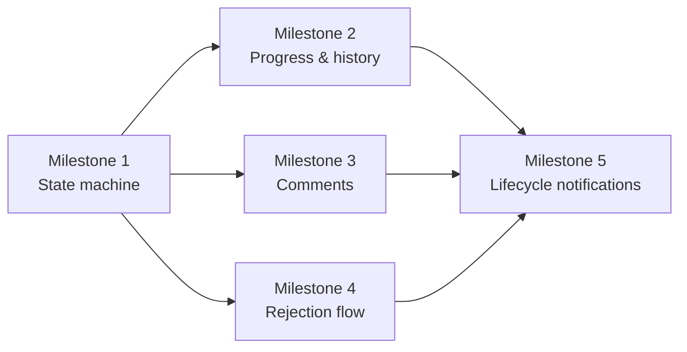

# Sprint 5 Plan: Task Lifecycle & Collaboration

## Goal

Build the execution path for tasks so assignees can start work, update progress, submit review evidence, collaborate through comments, and resolve rejection flows with a full audit trail.

## Scope

This sprint covers the state-machine and collaboration slice of F4.

In scope:
- Task detail view
- Status transitions and progress updates
- Review submission and return-to-work flow
- Comments, replies, and mention-style collaboration
- Task rejection and rejected-task handling
- Lifecycle history and notification hooks

Out of scope for this sprint:
- Task board and timeline views
- KPI dashboard/reporting
- Sub-task hierarchy
- Recurring tasks and dependency graphs
- Approval workflow and advanced planning views

## Milestone Breakdown

### Milestone 1: Task detail and state machine core

User stories:
- US-314
- US-402
- US-403
- US-404
- US-407

What it delivers:
- A complete task detail page with the core transitions for starting, blocking, submitting, and returning work.

Implementation surfaces:
- `app/tasks/[id]/page.tsx`
- `app/api/tasks/[id]/status/route.ts`
- `app/api/tasks/[id]/route.ts`
- `components/tasks/task-status-actions.tsx`
- `lib/tasks/state-machine.ts`

Dependencies:
- Depends on the task authoring and assignee data from Sprint 4.
- Status transitions must respect the task-status enum and authorization rules.

Test cases:
- Task detail loads title, description, assignee, deadline, priority, and tags.
- Start task records a start timestamp and changes status correctly.
- Block task requires a blocking reason and a blocker category.
- Review submission requires evidence and a summary.
- Return to In Progress preserves the review history.

Effort: 22 hours/person

### Milestone 2: Progress tracking and audit history

User stories:
- US-401
- US-309

What it delivers:
- Percentage progress updates with a visible history trail so managers can inspect task movement over time.

Implementation surfaces:
- `components/tasks/progress-editor.tsx`
- `app/api/tasks/[id]/progress/route.ts`
- `app/api/tasks/[id]/history/route.ts`
- `lib/tasks/progress-history.ts`

Dependencies:
- Depends on the task status model and audit log infrastructure.

Test cases:
- Progress can be edited by the assignee only.
- Progress values stay within 0-100.
- History records each change with a timestamp.
- Progress UI shows the last saved state after refresh.
- Task history list is ordered newest first.

Effort: 14 hours/person

### Milestone 3: Comments and threaded collaboration

User stories:
- US-315
- US-316

What it delivers:
- Task comments, replies, and resolved-thread behavior for manager/employee coordination.

Implementation surfaces:
- `app/api/tasks/[id]/comments/route.ts`
- `components/tasks/comment-thread.tsx`
- `components/tasks/comment-composer.tsx`
- `lib/tasks/comment-threading.ts`

Dependencies:
- Depends on task detail and comment storage in the shared schema.

Test cases:
- Comment composer rejects empty text.
- Replies nest under the parent comment.
- Author can edit or delete their own comment.
- New comment triggers the expected notification hook.
- Resolved comment state is visible in the thread.

Effort: 16 hours/person

### Milestone 4: Rejection and resolution flow

User stories:
- US-322
- US-323

What it delivers:
- Clear rejection handling when assignees decline work and a dedicated manager queue for tasks that need reassignment.

Implementation surfaces:
- `app/api/tasks/[id]/reject/route.ts`
- `app/api/tasks/rejected/route.ts`
- `components/tasks/reject-task-dialog.tsx`
- `components/tasks/rejected-task-table.tsx`

Dependencies:
- Depends on the state machine and notification layer from Milestone 1.
- Rejection must be recorded in task history so it can be audited later.

Test cases:
- Reject requires a reason with minimum length.
- Task moves back to a manager-visible waiting state.
- Manager receives the rejection notification immediately.
- Rejected-task list filters only declined items.
- Quick reassign action preserves the rejection history.

Effort: 14 hours/person

### Milestone 5: Lifecycle notifications and resilience

User stories:
- US-401
- US-402
- US-403
- US-404
- US-407
- US-309

What it delivers:
- Notification hooks and lifecycle consistency so all task-state changes remain visible to the right people.

Implementation surfaces:
- `lib/notifications/task-events.ts`
- `app/api/notifications/route.ts`
- `lib/tasks/lifecycle-events.ts`

Dependencies:
- Depends on the task state machine, audit log, and notification tables from the architecture.

Test cases:
- Start/block/review/return events are emitted once per action.
- Task history records who changed state and when.
- Notification payloads include the task id and action type.
- Failed lifecycle updates return the documented validation envelope.

Effort: 10 hours/person

## Dependency Map

Key story-level dependencies:
- US-401, US-402, US-403, US-404, and US-407 all depend on the state machine in US-314 being established first.
- US-315 and US-316 depend on task detail and the comment table.
- US-322 and US-323 depend on the transition logic so rejection is recorded cleanly.
- US-309 depends on the lifecycle events already being logged in the same task record.

## Implementation Order

1. Milestone 1
2. Milestone 2
3. Milestone 3
4. Milestone 4
5. Milestone 5

## Effort Summary

- Milestone 1: 22 hours/person
- Milestone 2: 14 hours/person
- Milestone 3: 16 hours/person
- Milestone 4: 14 hours/person
- Milestone 5: 10 hours/person
- Total: 76 hours/person

## Repository Links

- [PRD](../PRD.md)
- [Architecture](../ARCHITECTURE.md)
- [Decision Log](../decision-log.md)
- [Testing Guide](../testing.md)

## Maintenance Note

Update this file when task lifecycle rules, comment behavior, rejection handling, or progress semantics change.