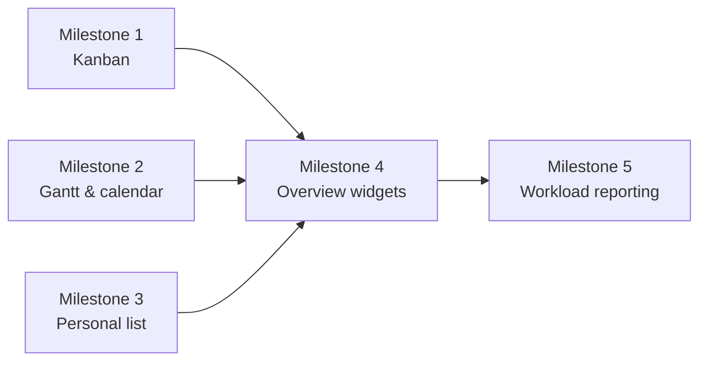

# Sprint 6 Plan: Task Views & Planning

## Goal

Give managers and employees multiple ways to read task load and deadlines so the same task data can be consumed through Kanban, timeline, calendar, personal list, and overview dashboards.

## Scope

This sprint covers the presentation and navigation slice of F4.

In scope:
- Kanban board
- Gantt/timeline view
- Calendar view
- Personal task list and filters
- Department overview and due-soon widgets
- Workload overview for managers

Out of scope for this sprint:
- Task creation and mutation workflows
- Task comments and collaboration
- KPI scoring and reporting
- Recurrence, dependencies, subtasks, and approval workflows
- Administrative user management or security policy

## Milestone Breakdown

### Milestone 1: Kanban board and task counters

User stories:
- US-312

What it delivers:
- A move-friendly board for state-based task review with column counters and filtered columns.

Implementation surfaces:
- `app/tasks/page.tsx`
- `components/tasks/kanban-board.tsx`
- `components/tasks/task-card.tsx`

Dependencies:
- Depends on the task lifecycle and status model from Sprint 5.

Test cases:
- Board renders the five expected columns.
- Column counts update as tasks move.
- Filter by assignee only shows matching cards.
- Drag/drop change is reflected optimistically and persists.

Effort: 18 hours/person

### Milestone 2: Gantt and calendar planning views

User stories:
- US-313
- US-318

What it delivers:
- Timeline and calendar planning surfaces for deadline management and long-range scheduling.

Implementation surfaces:
- `app/tasks/gantt/page.tsx`
- `app/tasks/calendar/page.tsx`
- `components/tasks/gantt-chart.tsx`
- `components/tasks/calendar-grid.tsx`

Dependencies:
- Depends on due-date data from Sprint 4 and status history from Sprint 5.

Test cases:
- Gantt groups tasks across the selected time range.
- Deadline markers appear in the expected place.
- Calendar can switch month backward and forward.
- Day click reveals tasks due on that date.
- Overdue tasks are visually highlighted.

Effort: 18 hours/person

### Milestone 3: Personal task list and month filters

User stories:
- US-329
- US-330

What it delivers:
- A focused personal queue for assignees with priority ordering and month-based filtering.

Implementation surfaces:
- `app/me/tasks/page.tsx`
- `components/tasks/personal-task-list.tsx`
- `components/tasks/task-month-filter.tsx`

Dependencies:
- Depends on assignment data and the task priority model from Sprint 4.

Test cases:
- Default sort is emergency, high, normal, low.
- Users can change the sort order.
- Month filter updates the visible list.
- Done/Cancelled tasks can be hidden.
- Weight summary for the current month is computed consistently.

Effort: 16 hours/person

### Milestone 4: Department overview and due-soon widgets

User stories:
- US-321
- US-328

What it delivers:
- Manager-facing task overview widgets for upcoming deadlines and department-wide status monitoring.

Implementation surfaces:
- `app/dashboard/page.tsx`
- `components/dashboard/due-soon-widget.tsx`
- `components/dashboard/task-overview.tsx`
- `app/api/tasks/summary/route.ts`

Dependencies:
- Depends on task status aggregation and the department model from Sprint 3.

Test cases:
- Due-soon widget shows the next 7 days.
- Quick reminder action targets the selected assignee.
- Overview dashboard shows tasks grouped by status.
- Overdue tasks are visually emphasized.
- Filters by employee, team, month, and priority behave together.

Effort: 18 hours/person

### Milestone 5: Workload reporting and exportable summaries

User stories:
- US-319

What it delivers:
- A manager-level workload report that shows task counts, weight balance, and export-ready summary data.

Implementation surfaces:
- `app/reports/workload/page.tsx`
- `app/api/reports/workload/route.ts`
- `components/reports/workload-chart.tsx`
- `components/reports/workload-table.tsx`

Dependencies:
- Depends on task assignment data, status totals, and the report query patterns defined in the architecture.

Test cases:
- Report groups tasks by assignee and status.
- Weight bars reflect the assigned workload correctly.
- Over-80-percent warnings show on the correct rows.
- Export returns the current filtered dataset.
- Large result sets remain responsive with pagination or server aggregation.

Effort: 14 hours/person

## Dependency Map

Key story-level dependencies:
- US-312 depends on the state machine from Sprint 5.
- US-313 and US-318 depend on due-date data being reliable.
- US-329 and US-330 depend on assignee and priority metadata from Sprint 4.
- US-321 and US-328 depend on the status aggregation already being available on the backend.
- US-319 depends on the workload math and summary query shape used by the overview dashboard.

## Implementation Order

1. Milestone 1
2. Milestone 2
3. Milestone 3
4. Milestone 4
5. Milestone 5

## Effort Summary

- Milestone 1: 18 hours/person
- Milestone 2: 18 hours/person
- Milestone 3: 16 hours/person
- Milestone 4: 18 hours/person
- Milestone 5: 14 hours/person
- Total: 84 hours/person

## Repository Links

- [PRD](../PRD.md)
- [Architecture](../ARCHITECTURE.md)
- [Decision Log](../decision-log.md)
- [Testing Guide](../testing.md)

## Maintenance Note

Update this file when the board, timeline, calendar, dashboard, or workload-report contract changes.