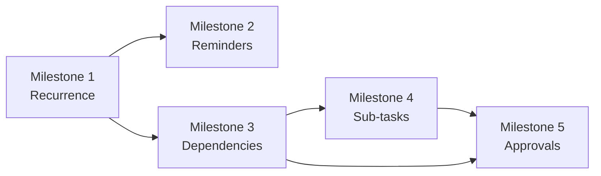

# Sprint 7 Plan: Task Automation & Structure

## Goal

Automate the task system with recurrence, reminders, dependency checks, sub-task hierarchy, and approval gates so managers can control more complex work flows without manual coordination.

## Scope

This sprint covers the orchestration slice of F4.

In scope:
- Recurring task schedules
- Deadline reminder windows
- Task dependency graph and cycle detection
- Sub-task creation and ordering
- Approval workflow for important tasks

Out of scope for this sprint:
- Board/timeline/calendar views
- KPI scoring and reporting
- General lifecycle comments and progress editing
- Admin/user governance features outside task orchestration

## Milestone Breakdown

### Milestone 1: Recurring task scheduler

User stories:
- US-307

What it delivers:
- Weekly/monthly recurring tasks that can be generated automatically and cancelled safely.

Implementation surfaces:
- `app/api/tasks/recurrences/route.ts`
- `app/api/tasks/recurrences/[id]/route.ts`
- `lib/tasks/recurrence.ts`
- `lib/jobs/task-scheduler.ts`

Dependencies:
- Depends on the task CRUD foundation from Sprint 4.
- Depends on a reliable date/time abstraction and the department owner context.

Test cases:
- Daily/weekly/monthly recurrence creates the next task instance correctly.
- Cancelled recurrence stops future task generation.
- Generated task inherits the configured assignee and priority.
- Upcoming schedule list shows the correct next execution time.

Effort: 18 hours/person

### Milestone 2: Deadline reminders and notification windows

User stories:
- US-317

What it delivers:
- Configurable reminders before deadlines with workday-aware behavior and task-level toggles.

Implementation surfaces:
- `app/api/tasks/[id]/reminders/route.ts`
- `lib/notifications/task-reminders.ts`
- `components/tasks/reminder-settings.tsx`

Dependencies:
- Depends on due-date data from Sprint 4 and the notification model from the architecture.

Test cases:
- Reminder windows support 1, 3, and 7 days before deadline.
- Weekend days are skipped when configured as workday-only.
- Reminder can be turned off per task.
- Assignee can create a personal reminder without changing the manager rule.

Effort: 14 hours/person

### Milestone 3: Dependency graph and validation

User stories:
- US-320

What it delivers:
- A dependency model that blocks invalid execution order and detects circular references before save.

Implementation surfaces:
- `app/api/tasks/[id]/dependencies/route.ts`
- `lib/tasks/dependency-graph.ts`
- `components/tasks/dependency-editor.tsx`

Dependencies:
- Depends on the task schema, parent-child relations, and lifecycle state machine.

Test cases:
- Dependency can be added and removed from a task.
- Circular dependencies are rejected.
- A dependent task cannot start before prerequisite completion.
- Completing a prerequisite emits the expected notification hook.

Effort: 18 hours/person

### Milestone 4: Sub-task hierarchy and ordering

User stories:
- US-326
- US-327

What it delivers:
- Sub-task tree views, ordering controls, and parent-progress aggregation for leader-managed work breakdown.

Implementation surfaces:
- `app/tasks/[id]/subtasks/page.tsx`
- `app/api/tasks/[id]/subtasks/route.ts`
- `app/api/tasks/[id]/subtasks/reorder/route.ts`
- `components/tasks/subtask-tree.tsx`

Dependencies:
- Depends on the self-referencing task model and Sprint 5 state controls.

Test cases:
- Create sub-task from a parent task.
- Sub-task has no independent weight.
- Parent progress is derived from sub-task completion average.
- Reordering changes the display order and persists.
- Completed sub-tasks are grouped separately.

Effort: 18 hours/person

### Milestone 5: Approval workflow for high-risk tasks

User stories:
- US-331

What it delivers:
- A formal approval gate so critical tasks are reviewed before they are dispatched to assignees.

Implementation surfaces:
- `app/api/tasks/[id]/approval/route.ts`
- `components/tasks/task-approval-panel.tsx`
- `lib/tasks/approval.ts`

Dependencies:
- Depends on the task state machine and audit log infrastructure.

Test cases:
- Task can be marked as requiring approval.
- Unapproved task does not reach the assignee queue.
- Approve/reject path accepts comments and records audit data.
- Pending approvals are visible in the manager queue.

Effort: 14 hours/person

## Dependency Map

Key story-level dependencies:
- US-307 needs task creation and date handling from Sprint 4.
- US-317 depends on the due-date field and notification infrastructure.
- US-320 depends on the task relation model so the graph can be validated.
- US-326 and US-327 depend on the self-referencing task structure.
- US-331 depends on the status transition logic from Sprint 5.

## Implementation Order

1. Milestone 1
2. Milestone 2
3. Milestone 3
4. Milestone 4
5. Milestone 5

## Effort Summary

- Milestone 1: 18 hours/person
- Milestone 2: 14 hours/person
- Milestone 3: 18 hours/person
- Milestone 4: 18 hours/person
- Milestone 5: 14 hours/person
- Total: 82 hours/person

## Repository Links

- [PRD](../PRD.md)
- [Architecture](../ARCHITECTURE.md)
- [Decision Log](../decision-log.md)
- [Testing Guide](../testing.md)

## Maintenance Note

Update this file when recurrence rules, reminder windows, dependency checks, sub-task behavior, or approvals change.