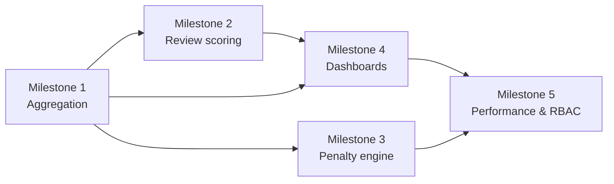

# Sprint 8 Plan: KPI Metrics & Reporting

## Goal

Turn task execution data into reliable KPI outputs for managers and directors, with correct scoring rules, overdue penalties, and fast reporting for large departments.

## Scope

This sprint covers the KPI and reporting slice of F4.

In scope:
- KPI calculation model
- Review score entry and approval output
- Overdue penalty calculation
- Team, department, and personal KPI reporting
- Cached aggregation for large datasets

Out of scope for this sprint:
- Task authoring and lifecycle changes
- Board/timeline/calendar views
- Recurrence, subtasks, and approvals
- Admin and security governance outside KPI access control

## Milestone Breakdown

### Milestone 1: KPI aggregation foundation

User stories:
- US-405
- US-406

What it delivers:
- A reusable KPI calculation engine and persisted summary data that can be read quickly by dashboards and reports.

Implementation surfaces:
- `app/api/kpi/me/route.ts`
- `app/api/kpi/team/route.ts`
- `app/api/reports/kpi/route.ts`
- `lib/kpi/calculator.ts`
- `lib/kpi/snapshot.ts`

Dependencies:
- Depends on task status, deadline, assignee, and progress data from Sprints 4 and 5.
- Depends on the KPI schema and snapshot tables in the architecture.

Test cases:
- KPI formula uses the defined weight and on-time completion rules.
- Aggregation is deterministic for the same task set.
- Empty dataset returns zeroed KPI values instead of errors.
- Summary data can be read from cached/snapshot storage.

Effort: 18 hours/person

### Milestone 2: Review scoring UI and manager workflow

User stories:
- US-405

What it delivers:
- Manager-side score entry for task review, including evidence awareness and approval/return actions.

Implementation surfaces:
- `app/tasks/[id]/review/page.tsx`
- `components/tasks/review-score-form.tsx`
- `components/tasks/review-evidence-panel.tsx`

Dependencies:
- Depends on the review submission flow from Sprint 5.

Test cases:
- Score input is limited to 0-100.
- Review screen shows evidence and task history.
- Approve and return actions are both available where allowed.
- Manager comment is optional and persists with the review.

Effort: 14 hours/person

### Milestone 3: Overdue penalty engine

User stories:
- US-406

What it delivers:
- Automatic overdue penalty calculation based on lateness at review time, with visible breakdown and audit logging.

Implementation surfaces:
- `lib/kpi/overdue-penalty.ts`
- `app/api/tasks/[id]/kpi-penalty/route.ts`
- `components/tasks/penalty-breakdown.tsx`

Dependencies:
- Depends on task deadlines, review timestamps, and the KPI score pipeline.

Test cases:
- Penalty uses the documented percentage per late day.
- Final score never drops below zero.
- Penalty breakdown is visible during review.
- Penalty details are written into the task log.

Effort: 14 hours/person

### Milestone 4: KPI dashboards and reporting views

User stories:
- US-319

What it delivers:
- Manager-facing KPI dashboards and exportable reports for individuals and teams.

Implementation surfaces:
- `app/dashboard/kpi/page.tsx`
- `components/dashboard/kpi-charts.tsx`
- `components/reports/kpi-report-table.tsx`
- `app/api/reports/kpi/route.ts`

Dependencies:
- Depends on the aggregation foundation and the same role-based access checks used for admin data.

Test cases:
- Report loads by month or time range.
- Charts render department and user breakdowns correctly.
- Export uses the active filter set.
- Large result sets remain paginated or server-aggregated.

Effort: 18 hours/person

### Milestone 5: Performance, cache, and RBAC hardening

User stories:
- US-405
- US-406
- US-319

What it delivers:
- The final pass on KPI performance and access rules so large departments stay under the latency target and non-authorized users cannot see other teams' data.

Implementation surfaces:
- `lib/kpi/cache.ts`
- `lib/kpi/permissions.ts`
- `app/api/reports/kpi/route.ts`

Dependencies:
- Depends on the reporting endpoints and the role model from Sprint 3.

Test cases:
- KPI report for large departments stays within the target latency.
- Employees cannot see KPI detail for other departments.
- Cache invalidation happens after task-state updates.
- Error states do not reveal private cross-department metrics.

Effort: 12 hours/person

## Dependency Map

Key story-level dependencies:
- US-405 and US-406 depend on the completed task lifecycle from Sprint 5.
- US-319 depends on the same task and assignment metrics used by the KPI engine.
- KPI dashboards must respect the role hierarchy and department boundaries defined in Sprint 3.

## Implementation Order

1. Milestone 1
2. Milestone 2
3. Milestone 3
4. Milestone 4
5. Milestone 5

## Effort Summary

- Milestone 1: 18 hours/person
- Milestone 2: 14 hours/person
- Milestone 3: 14 hours/person
- Milestone 4: 18 hours/person
- Milestone 5: 12 hours/person
- Total: 76 hours/person

## Repository Links

- [PRD](../PRD.md)
- [Architecture](../ARCHITECTURE.md)
- [Decision Log](../decision-log.md)
- [Testing Guide](../testing.md)

## Maintenance Note

Update this file when the KPI formula, penalty rule, dashboard layout, or report latency target changes.