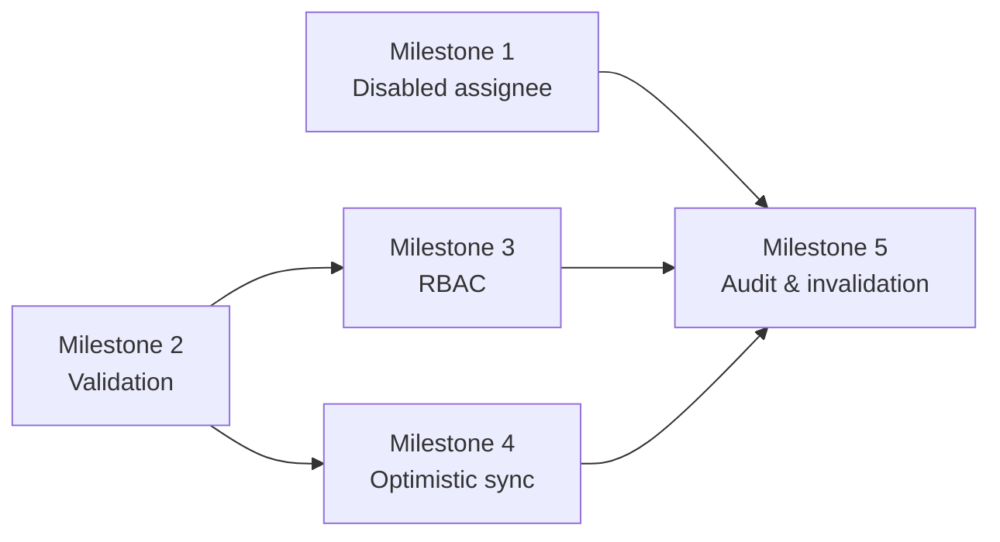

# Sprint 9 Plan: Task Platform Hardening & Edge Cases

## Goal

Close the remaining F4 edge cases so the task platform behaves safely when users, deadlines, permissions, or data volume behave unexpectedly.

## Scope

This sprint covers the operational hardening slice of F4 and absorbs the remaining acceptance gaps from the task spec.

In scope:
- Disabled assignee handling
- Past-deadline validation and mutation safety
- RBAC and department isolation for task/KPI reads
- Optimistic UI updates with short polling instead of heavy realtime
- Mutation audit logging and notification consistency
- Cache invalidation and data freshness on task changes

Out of scope for this sprint:
- New task features
- New KPI formulas
- Board/timeline/calendar UX
- Sub-task, approval, or recurrence feature work

## Milestone Breakdown

### Milestone 1: Disabled-assignee survivability

Coverage items:
- Task assigned to a user who later becomes disabled must not disappear silently.

Implementation surfaces:
- `app/api/tasks/[id]/reassign/route.ts`
- `app/api/tasks/[id]/status/route.ts`
- `lib/tasks/assignee-safety.ts`
- `lib/notifications/task-exceptions.ts`

Dependencies:
- Depends on the user-status model from Sprint 3 and the task assignment model from Sprint 4.

Test cases:
- Disabled assignee triggers a manager-visible alert.
- Task can be held, closed, or re-assigned according to the configured rule.
- The original assignee is removed from new assignment options.

Effort: 12 hours/person

### Milestone 2: Deadline and payload validation hardening

Coverage items:
- Deadline cannot move into the past.
- Validation errors must stay consistent across create, edit, and review flows.

Implementation surfaces:
- `lib/tasks/validation.ts`
- `app/api/tasks/route.ts`
- `app/api/tasks/[id]/route.ts`
- `app/api/tasks/[id]/status/route.ts`

Dependencies:
- Depends on the task CRUD and state machine already introduced.

Test cases:
- Past-date deadline updates are rejected.
- Invalid payloads return the documented error envelope.
- Validation rules stay aligned across create and patch endpoints.

Effort: 12 hours/person

### Milestone 3: RBAC and department isolation guards

Coverage items:
- Employees cannot read KPI or task data outside their authorized department scope.

Implementation surfaces:
- `lib/tasks/permissions.ts`
- `lib/kpi/permissions.ts`
- `app/api/tasks/route.ts`
- `app/api/reports/kpi/route.ts`

Dependencies:
- Depends on the role graph, department scoping, and the reporting endpoints from earlier sprints.

Test cases:
- Non-manager users cannot access protected report data.
- Department filters are enforced server-side, not only in the UI.
- Cross-department KPI reads are forbidden.

Effort: 14 hours/person

### Milestone 4: Optimistic updates and polling sync

Coverage items:
- Keep the task UI responsive without heavy websocket infrastructure.

Implementation surfaces:
- `components/tasks/task-refresh-poll.tsx`
- `components/tasks/optimistic-task-actions.tsx`
- `lib/tasks/polling.ts`

Dependencies:
- Depends on the task mutation routes and the current-task refresh endpoints.

Test cases:
- Optimistic state rolls back on server failure.
- Polling refreshes only the affected slice.
- UI remains usable during repeated task-state updates.

Effort: 10 hours/person

### Milestone 5: Audit, notifications, and cache invalidation

Coverage items:
- Every task mutation should be auditable, notify the right users, and refresh cached summary data.

Implementation surfaces:
- `lib/audit-logger.ts`
- `lib/notifications/task-events.ts`
- `lib/tasks/cache-invalidation.ts`

Dependencies:
- Depends on the shared audit log, notification tables, and KPI cache from Sprint 8.

Test cases:
- Task mutations create exactly one audit record.
- Notification payloads are tied to the correct task and actor.
- KPI and workload caches invalidate after task state or assignee changes.

Effort: 10 hours/person

## Dependency Map

Key coverage dependencies:
- Disabled-user behavior depends on the user lifecycle work from Sprint 3 and the assignment logic from Sprint 4.
- Validation and RBAC need to stay aligned with the task and KPI APIs from Sprints 4-8.
- Cache invalidation should be triggered by the same mutation path that writes the audit log.

## Implementation Order

1. Milestone 1
2. Milestone 2
3. Milestone 3
4. Milestone 4
5. Milestone 5

## Effort Summary

- Milestone 1: 12 hours/person
- Milestone 2: 12 hours/person
- Milestone 3: 14 hours/person
- Milestone 4: 10 hours/person
- Milestone 5: 10 hours/person
- Total: 58 hours/person

## Repository Links

- [PRD](../PRD.md)
- [Architecture](../ARCHITECTURE.md)
- [Decision Log](../decision-log.md)
- [Testing Guide](../testing.md)

## Maintenance Note

Update this file when task safety rules, RBAC boundaries, cache invalidation, or notification behavior changes.